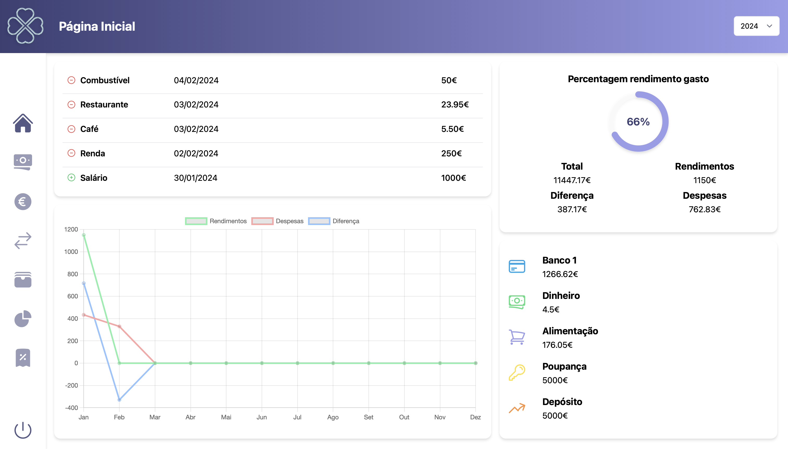

## Personal Finance Tracker

Esta aplicação web permite fazer o controlo das finanças pessoais.

## Acesso
A informação que será recolhida pela aplicação vai englobar:
* Contas
* Despesas
* Rendimentos
* Transferências
* IRS

De forma a ser possível aceder à aplicação é necessário definir um código PIN de quatro digítos, que será também utilizado para encriptar os dados da aplicação. 

# Armazenamento da informação
Quando a aplicação é iniciada, se a pasta e os ficheiros onde vai ser armazenada a informação não existirem, serão criados.
A estrutura destes ficheiros tem por base a criação de uma pasta `finances` ao nível da `root directory`, e é a seguinte:
* `accountsData.json`: vai guardar a informação relativa às contas do utilizador
* `expensesData.json`: vai armazenar a informação relativa às despesas
* `incomeData.json`: vai guardar a informação relativa aos rendimentos
* `transfersData.json`: vai armazenar a informação relativa às transferências monetárias entre contas
* `irsData.json`: vai guardar a informação relativa ao cálculo do IRS
* `pinData.json`: vai armazenar o código PIN para efeitos de autenticação

Todos estes ficheiros serão encriptados.

# Definir o código PIN
Se ainda não tiver sido definido um código PIN para a aplicação, deverá ser indicado para o fazer. É também neste momento que a pasta e ficheiros serão criados, caso ainda não existam.

# Autenticação
Se já tiver sido definido um código PIN, será indicado que é necessário a introdução deste.

Se o PIN introduzido estiver incorreto, será indicado o erro, sendo que não será possível aceder à aplicação. Caso contrário, o utilizador será redirecionado para a página inicial.

# Página Inicial

