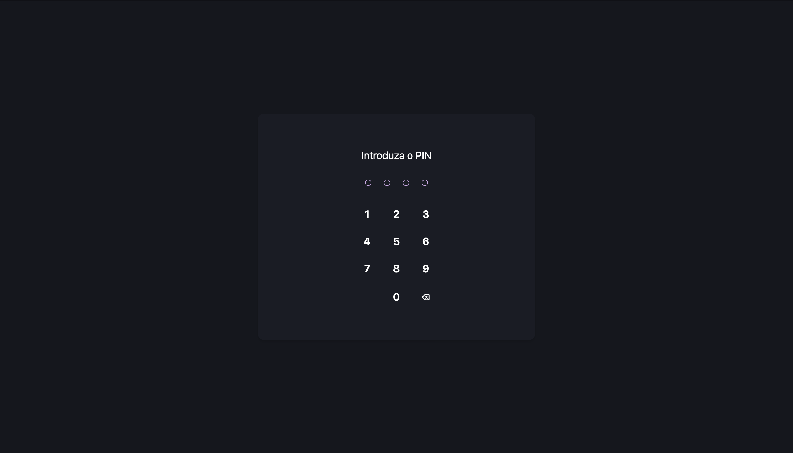
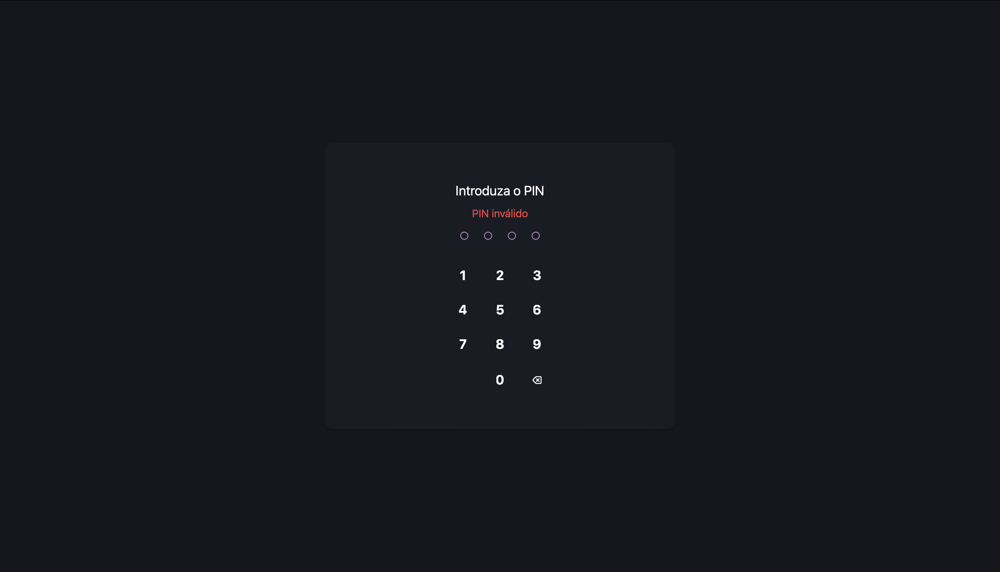
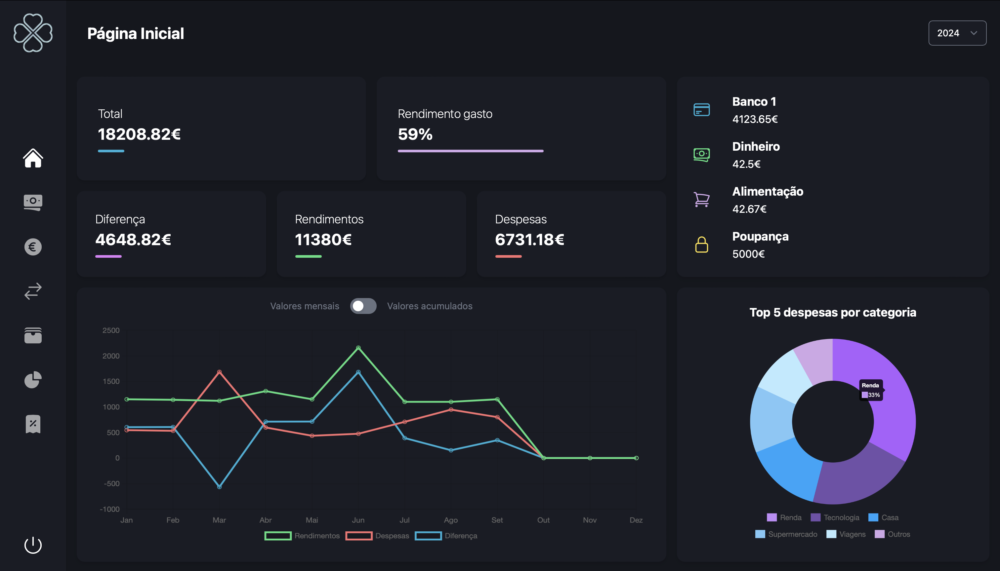
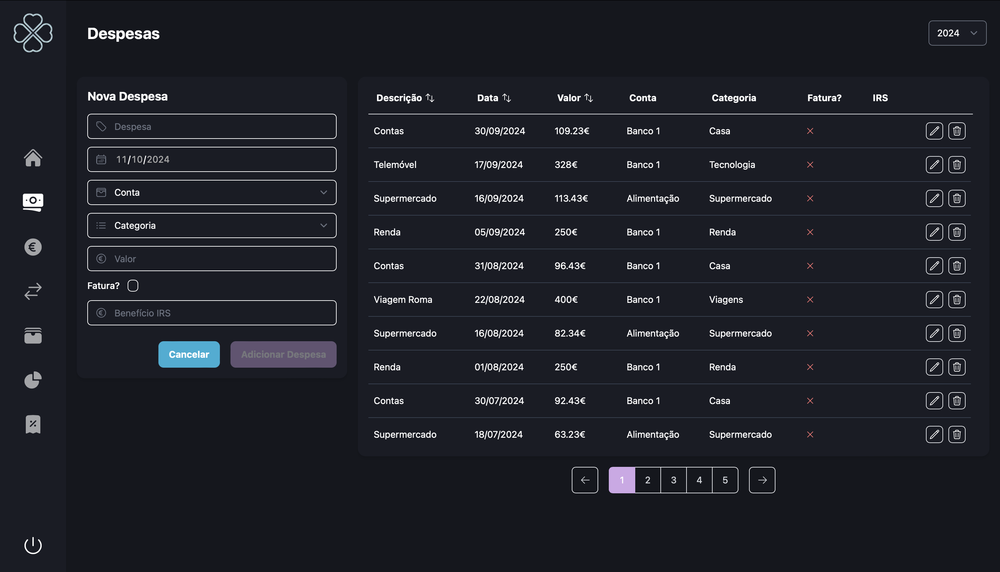
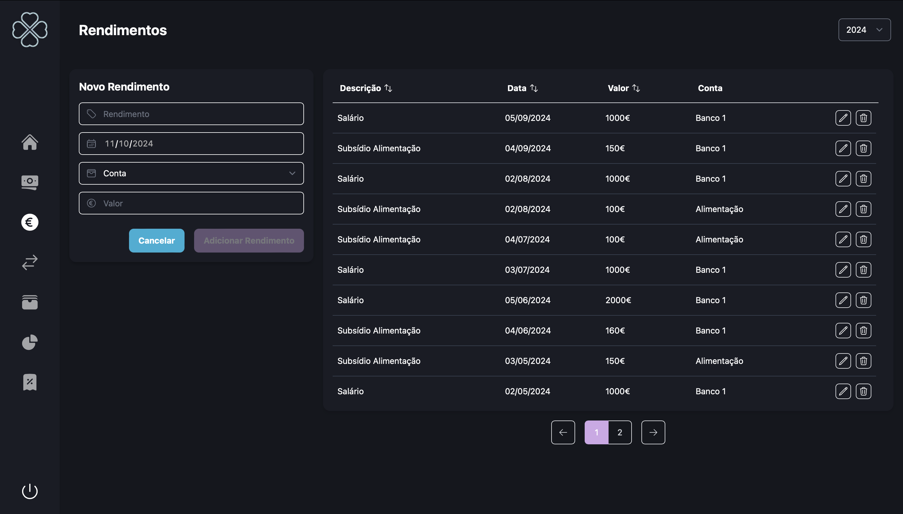
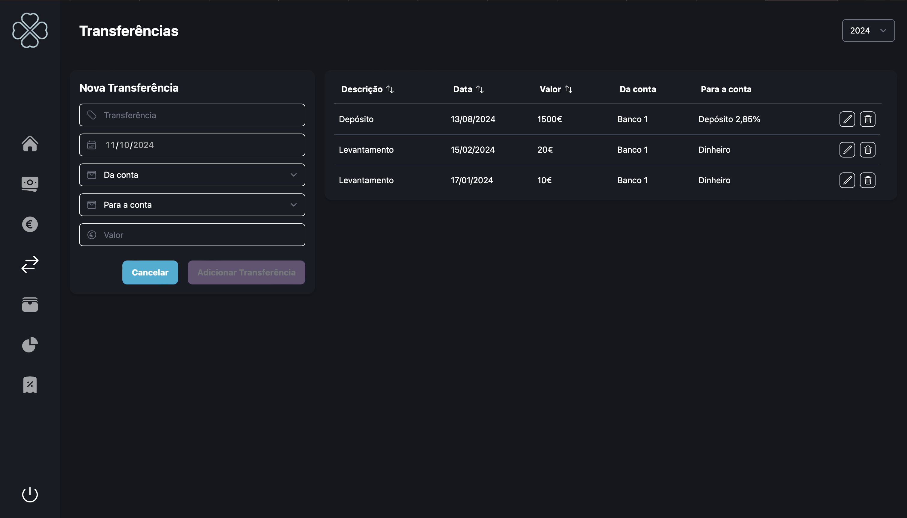

# Personal Finance Tracker

Esta aplicação web permite fazer o controlo das finanças pessoais.

# Manual de Utilização

<i>NOTA: Os valores apresentados nos prints utilizados neste manual são fictícios, gerados apenas para demonstração da aplicação.</i>

## Acesso
A informação que será recolhida pela aplicação vai englobar:
* Contas
* Despesas
* Rendimentos
* Transferências
* IRS

De forma a ser possível aceder à aplicação é necessário definir um código PIN de quatro digítos, que será também utilizado para encriptar os dados da aplicação. 

## Armazenamento da informação
Quando a aplicação é iniciada, se a pasta e os ficheiros onde vai ser armazenada a informação não existirem, serão criados.
A estrutura destes ficheiros tem por base a criação de uma pasta `finances` ao nível da `root directory`, e é a seguinte:
* `accountsData.json`: vai guardar a informação relativa às contas do utilizador
* `expensesData.json`: vai armazenar a informação relativa às despesas
* `incomeData.json`: vai guardar a informação relativa aos rendimentos
* `transfersData.json`: vai armazenar a informação relativa às transferências monetárias entre contas
* `irsData.json`: vai guardar a informação relativa ao cálculo do IRS
* `pinData.json`: vai armazenar o código PIN para efeitos de autenticação

Todos estes ficheiros serão encriptados.

## Definir o código PIN
Se ainda não tiver sido definido um código PIN para a aplicação, deverá ser indicado para o fazer. É também neste momento que a pasta e ficheiros serão criados, caso ainda não existam.

## Autenticação
Se já tiver sido definido um código PIN, será indicado que é necessário a introdução deste.

Se o PIN introduzido estiver incorreto, será indicado o erro, sendo que não será possível aceder à aplicação. Caso contrário, o utilizador será redirecionado para a página inicial.

## Página Inicial

Quando o utilizador introduz o PIN corretamente é redirecionado para a página inicial.

Aqui é possível observar a barra de navegação lateral que permite ao utilizador navegar entre a diferente informação:
* Página Inicial
* Despesas
* Rendimentos
* Transferências
* Contas
* Relatórios
* IRS
* Logout  

Nesta página é possível observar:

* No canto superior direito da página, uma dropdown com a lista de valores correspondentes ao ano, sendo que a opção de ano selecionada implica que toda a informação apresentada na aplicação se refere a esse ano
* Valores anuais referentes ao ano selecionado:
    * Valor total das contas registadas
    * Percentagem do rendimento gasto no ano selecionado
    * Diferença anual entre os rendimentos e as despesas
    * Valor total dos rendimentos desse ano
    * Valor total das despesas desse ano
* Gráfico mensal dos rendimentos, despesas e diferença
    * Valores mensais
    * Valores acumulados
* Contas registadas
* Top 5 categorias com maiores despesas (%)

## Despesas

Nesta página é possível adicionar despesas e visualizar todas as despesas relativas ao ano selecionado. Para adicionar uma nova despesa é necessário preencher a descrição da despesa, a data, e a conta, que apresenta uma lista com as contas ativas registadas. Os restantes campos são opcionais, sendo que é possível associar uma categoria à despesa, que depois poderá ser útil na análise dos relatórios. A lista de categorias está descrita no ficheiro `finances/app/lib/categories.ts` e podem ser adicionadas ou removidas consoante necessidade. É possível também eliminar depesas, assim como editar despesas previamente criadas.

## Rendimentos

Nesta página é possível adicionar rendimentos e visualizar todos os rendimentos relativos ao ano selecionado. Para adicionar um novo rendimento é necessário preencher a descrição, a data, e a conta, que apresenta uma lista com as contas ativas registadas. É possível também eliminar rendimentos, assim como editar registos previamente criados.

## Transferências

É também possível registar transferências monetárias entre contas, sendo que é obrigatório preencher a descrição, a data, e as contas envolvidas na transferência. É possível também eliminar transferências, assim como editar registos previamente criados.

## Contas

Nesta página é possível criar contas e visualizar todas as contas existentes. Para adicionar uma nova conta é necessário preencher o nome e o tipo da conta. Os tipos de conta estão atualmente definidos no ficheiro `finances/app/lib/categories.ts`:

* Cartão
* Dinheiro
* Poupança
* Cartão Alimentação
* Depósito a Prazo
* Certificado de Aforro

Os restantes campos são opcionais, sendo que a flag 'Ativa?' representa se a conta se encontra ativa ou não. É também possível ativar ou inativar contas, assim como editar contas previamente criadas.

## Relatórios

Nesta página é possível observar informação acerca das despesas do ano selecionado. É possível consultar uma tabela organizada por meses e categorias, assim como um gráfico circular com os valores anuais de despesas por categoria, e o top 5 das categorias onde foram efetuadas mais despesas.

## IRS

Nesta página é possível fazer uma simulaçáo do cálculo do valor do IRS. Esta simulação não contempla todas situações existentes para o cálculo do valor do IRS, e por isso não deve ser considerado como valor exato. É apenas uma simulação de alto nível e o valor gerado poderá ser diferente do real.

# TO DO:
* Responsividade
* Filtros nas tabelas
* Melhoria da simulação do IRS
* Tradução EN
* Animações